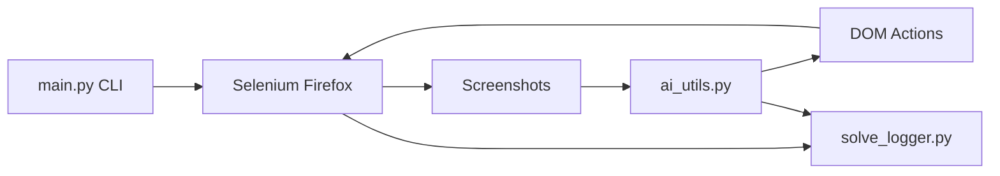

# System Patterns: AI CAPTCHA Bypass
*Version: 1.0*
*Created: 2026-06-07*
*Last Updated: 2026-06-07*

## Architecture Overview

Arquitetura em camadas simples: CLI → Selenium (browser) → captura visual → IA (Gemini/OpenAI) → ação no DOM → logging de resultado.

**Componente futuro:** servidor Flask local servindo CAPTCHAs customizados, apontado pelo bot em vez de URLs 2captcha.

## Key Components

- `main.py` — ponto de entrada; roteia por tipo de CAPTCHA; gerencia driver Firefox
- `ai_utils.py` — prompts e chamadas às APIs OpenAI/Gemini por tipo de desafio
- `puzzle_solver.py` — lógica específica de slider puzzle (GeeTest) com correção iterativa
- `solve_logger.py` — persistência JSON de tentativas e resumo de taxa de sucesso
- `browser_use/text.py` — utilitários auxiliares de browser
- `captcha_server.py` (planejado) — Flask servindo CAPTCHAs customizados com parâmetros variáveis

## Design Patterns in Use

- **Strategy:** provider de IA selecionável via CLI (`--provider gemini|openai`)
- **Template prompts:** cada tipo de CAPTCHA tem prompt dedicado em `ai_utils.py`
- **Observer/Logging:** `log_attempt` + `log_result` registram ciclo completo da tentativa
- **Retry:** `complicated_text_test` tenta até 3 vezes; reCAPTCHA itera desafios de imagem

## Data Flow

1. Usuário executa `python main.py <tipo> --provider gemini --model gemini-2.5-flash`
2. Selenium abre Firefox e navega para URL do demo (2captcha ou local)
3. Elementos do CAPTCHA são capturados como screenshots
4. Imagens são enviadas à IA com prompt específico do tipo
5. Resposta da IA é parseada (texto, coordenadas, tiles, distância)
6. Selenium executa a ação (digitar, clicar tiles, arrastar slider)
7. Sucesso/falha é verificado no DOM
8. `solve_logger` persiste em `logs/solve_log.json`
9. Em caso de sucesso, GIF salvo em `successful_solves/`

## Key Technical Decisions

- **Gemini Flash como padrão:** gratuito e suficiente para experimentos acadêmicos
- **Firefox via Selenium:** escolha do projeto original; sem plano de migrar para Chrome
- **JSON flat file para logs:** simples, auditável, sem banco de dados
- **2captcha demo como baseline:** ambiente controlado e público para comparação inicial
- **Flask para CAPTCHAs customizados:** permite variar parâmetros procedurais localmente

## Component Relationships

- `main.py` importa funções de `ai_utils.py`, `puzzle_solver.py` e `solve_logger.py`
- `ai_utils.py` chama `log_attempt` durante interações com IA
- `main.py` chama `log_result` após verificação de sucesso no browser
- Servidor Flask (futuro) será consumido pelo mesmo fluxo Selenium, trocando apenas a URL alvo

---

*This document captures the system architecture and design patterns used in the project.*
